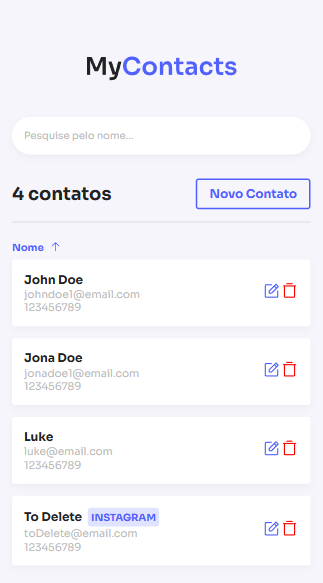
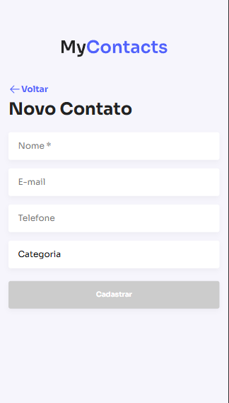
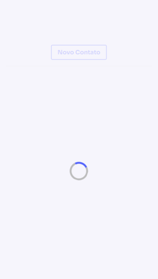
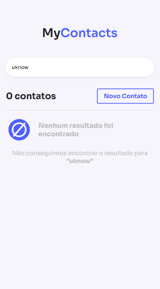

# MyContacts

Este projeto é um CRUD simples de contatos.

1. **Tela Inicial**
2. **Novo Contato**
3. **Loading**
4. **404 (Busca de Usuário)**

## Funcionalidades

    🚧 Em Construção 🚧

-   Listar contatos
-   Adicionar novos contatos
-   Mostrar tela de carregamento durante operações assíncronas
-   Exibir uma página 404 para buscas de usuários que não existem

---

## Tecnologias Utilizadas

-   **REACT**, **STYLED COMPONENTS**

---

## Estrutura das Telas

### 1. Tela Inicial

Exibe a lista de contatos cadastrados. Inclui botões para adicionar, editar ou excluir contatos.



### 2. Novo Contato

Formulário para criar um novo contato, solicitando nome, e-mail e telefone.



### 3. Loading

Mostra um spinner ou indicador de carregamento enquanto as operações assíncronas são realizadas.



### 4. 404 (Busca de Usuário)

Exibe uma mensagem indicando que o usuário buscado não foi encontrado.



## Contribuição

1. Faça um fork do projeto.
2. Crie uma branch para sua feature:
    ```bash
    git checkout -b minha-feature
    ```
3. Commit suas mudanças:
    ```bash
    git commit -m 'Adicionei minha feature'
    ```
4. Faça um push para sua branch:
    ```bash
    git push origin minha-feature
    ```
5. Abra um Pull Request.

---

## Licença

Este projeto está sob a licença MIT. Veja o arquivo [LICENSE](./LICENSE) para mais detalhes.
